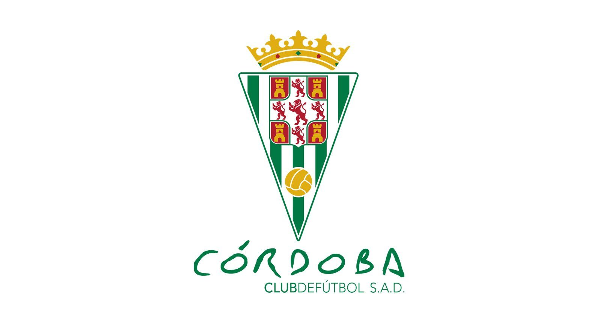

# Córdoba CF Calendar



### Description

This project integrates the matches on the 2025 Córdoba CF calendar with Google Calendar.

### How to start?

It is recommended to launch the script in a virtual environment. Create it and download the dependencies there:

```bash
# install virtual venv
pip install virtualenv

# create the virtual environment
python3 -m venv nombre_del_entorno

# activate the virtual environment (Linux/macOS)
source nombre_del_entorno/bin/activate

# download dependencies
pip install -r requirements.txt
```

There are two parts of code:

The collector.py file, collect matches information from [Besoccer API ](https://api.besoccer.com/es/presupuestos) and its results are in matches.txt file. The .env.template is for your Besoccer API_KEY. You can choose your team by writing it on the .env file.

The second part is the integration with Google Calendar. It is necessary to create a Google project to get your credentials.json. Here is a [tutorial](https://www.youtube.com/watch?v=eqZyPYlp3nw&t=139s) that explain it. 

Run the code with:
```bash
python3 launcher.py
```

### Members
- [Álvaro Serrano](https://github.com/Serranito09/Serranito09)
- [Rafael Perez](https://github.com/Rafapeerez/)